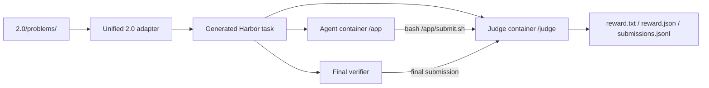

# Contributing Frontier-CS 2.0 Tasks

Frontier-CS 2.0 is for open-ended optimization tasks that need an agent-facing
Harbor environment, iterative score feedback, and task-specific evaluators.
Most new tasks should be added as a self-contained directory under
`2.0/problems/`; the unified 2.0 Harbor adapter discovers them automatically.

## Minimal Layout

Create one directory per task:

```text
2.0/problems/<problem_id>/
  config.yaml
  readme
  evaluator.py
  evaluate.sh
  reference.py
```

Use a lowercase `snake_case` `<problem_id>`. This is the stable Frontier-CS
CLI id, for example:

```bash
uv run frontier show 2.0 erdos_unit_distance
uv run frontier harbor trial 2.0 erdos_unit_distance -a codex -m <model> --json
```

The generated Harbor task id replaces underscores with hyphens:
`frontier-cs-2-0-erdos-unit-distance`.

## Required Files

`readme`

Public task statement. This is copied into the Harbor task instruction. Include
the interface, validity constraints, scoring rule, and any visible resource
budget that matters for algorithm design.

`config.yaml`

Task metadata consumed by the CLI and Harbor adapter. A small Python task can be
as simple as:

```yaml
tag: geometry
runtime:
  language: python
  timeout_seconds: 10800
  environment: "Python 3.11; no external packages required"
  docker:
    image: ubuntu:24.04
```

System-style tasks can declare stronger resources, package dependencies, and
directory submissions:

```yaml
tag: systems
runtime:
  language: rust
  timeout_seconds: 10800
  environment: "Rust project; hidden benchmark; Python/NumPy judge"
  apt_packages:
    - build-essential
    - cargo
    - rustc
  judge_apt_packages:
    - python3-numpy
  judge_pip_packages:
    - faiss-cpu
  docker:
    image: ubuntu:24.04
    judge_image: ghcr.io/frontiercs/frontiercs-task-data:latest
environment:
  cpus: 8
  memory_mb: 16384
  storage_mb: 8192
  build_timeout_seconds: 3600
submission:
  kind: directory
  path: /app
  exclude:
    - target
    - .git
```

`evaluator.py`

The task evaluator. It must expose:

```python
def evaluate(solution_path: str) -> tuple[float, float, str]:
    ...
```

or:

```python
def evaluate(solution_path: str) -> tuple[float, float, str, dict]:
    ...
```

Return values are:

```text
score, score_unbounded, message[, metrics]
```

`score` is the bounded score reported to Harbor and should normally be in
`[0, 100]`. `score_unbounded` may equal `score` unless the task has a meaningful
unbounded objective. `message` should contain public feedback only. `metrics`
is optional and is surfaced in Harbor result JSON.

The evaluator may also expose:

```python
def prepare() -> dict:
    ...
```

`prepare()` runs once when the black-box judge starts. Use it for expensive
trial-local setup such as dataset generation, loading a baseline, or warming a
hidden benchmark. The returned dictionary is written to judge readiness logs and
may be inspected after a trial.

`evaluate.sh`

Local CLI wrapper for non-Harbor evaluation. Keep it simple: call the evaluator
on the provided solution and print the score/message expected by the Frontier-CS
CLI.

`reference.py`

A minimal valid solution or baseline. It does not need to be strong, but it
should make local smoke tests straightforward.

## Submission Modes

By default, a 2.0 task expects a single file submission at `/app/solution.py`.
Override this in `config.yaml` when the task needs a different artifact.

File submission:

```yaml
submission:
  kind: file
  path: /app/solution.json
```

Directory submission:

```yaml
submission:
  kind: directory
  path: /app
  exclude:
    - target
    - .git
```

Directory submissions are snapshotted and sent to the judge as an archive. Use
them for service tasks, Rust/Cargo projects, or tasks where the agent must edit
multiple files.

## Harbor Evaluation Flow

Generated Harbor tasks use a black-box judge sidecar. The agent sees `/app`,
the problem statement, and helper scripts; it does not see `evaluator.py`.



During a trial, the agent can call:

```bash
bash /app/submit.sh
```

The helper packages the configured submission path, sends it to the judge, and
prints score feedback. Harbor trial results keep the best successful iterative
submission if the agent times out or the final artifact is worse.

## Black-Box Safety

Treat evaluator output as adversarial. Agents can intentionally print file
contents, traceback text, environment variables, or hidden paths. A good 2.0
evaluator should:

- avoid returning raw submitted stdout/stderr;
- avoid returning full tracebacks from solution execution;
- keep hidden data and evaluator source out of `/app`;
- return public metrics and concise errors only;
- smoke-test invalid or malicious submissions before opening a PR.

If a task needs hidden datasets or heavy judge-only dependencies, prefer
`runtime.docker.judge_image` so the judge container can contain data that the
agent workspace does not mount.

## When to Use Custom Images

Most tasks can use `ubuntu:24.04` plus `apt_packages` and
`judge_apt_packages`. Use custom images when package installation is too slow,
too brittle, too large, or not enough to describe the environment cleanly.

There are two image roles:

- `runtime.docker.image`: the public agent workspace image;
- `runtime.docker.judge_image`: the private judge/verifier image.

Use a custom agent image when the model needs a richer runnable environment in
`/app`, for example:

- compilers, SDKs, or build tools that are slow to install every trial;
- starter-project dependencies that should already be cached;
- domain tooling the agent is expected to call directly;
- service runtimes needed to run or debug the submitted system;
- reproducible OS/package versions that materially affect solution behavior.

Use a separate custom judge image when the evaluator needs files or dependencies
that should not be copied into `/app`.

Good reasons include:

- hidden benchmark data, private test cases, or reference artifacts;
- large static assets that would make every generated Harbor task too heavy;
- licensed or task-specific binaries that only the evaluator should call;
- expensive dependencies needed only by scoring, not by the agent's solution;
- prebuilt datasets or caches that should be versioned with the task image.

For example, BBO-style placement tasks can put benchmark data and evaluator-only
placement tooling in a judge image while keeping the agent container small and
clean. The task still uses the same 2.0 adapter contract: the agent submits via
`/app/submit.sh`, and only the judge/verifier side can access the image
contents.

Declare custom images in `config.yaml`:

```yaml
runtime:
  docker:
    image: ghcr.io/frontiercs/frontiercs-task-agent:latest
    judge_image: ghcr.io/frontiercs/frontiercs-bboplace-data:2026-06-ispd-iccad
```

If the same image is safe and useful for both roles, set only
`runtime.docker.image`. If the judge needs hidden assets, set `judge_image`
separately. Keep the public `readme` clear about what is visible to the agent
and what is hidden in the judge. Do not require contributors or agents to
manually mount hidden data; it should be part of the generated Harbor
environment.

## Validation Checklist

From the repo root:

```bash
uv run frontier list 2.0
uv run frontier show 2.0 <problem_id>
```

Compile the evaluator:

```bash
PYTHONPYCACHEPREFIX=/private/tmp/frontier-cs-pycache \
python3 -m py_compile 2.0/problems/<problem_id>/evaluator.py
```

Run a local smoke test:

```bash
python3 2.0/problems/<problem_id>/evaluator.py \
  2.0/problems/<problem_id>/reference.py
```

Generate the Harbor task:

```bash
PYTHONPATH=adapters/frontier-cs-2.0/src \
uv run --no-sync python -m frontier_cs_2_0.main \
  --source "$PWD" \
  --output-dir /private/tmp/frontier-cs-2-gen-test \
  --task-ids <problem_id> \
  --overwrite
```

Run a Harbor smoke trial:

```bash
uv run frontier harbor trial 2.0 <problem_id> \
  -a codex \
  -m <model> \
  --agent-timeout 600 \
  --verifier-timeout 600 \
  --force-build \
  --json
```

Before opening a PR, include the new problem id, scoring rule, resource budget,
validation commands, and at least one Harbor smoke result in the PR summary.
